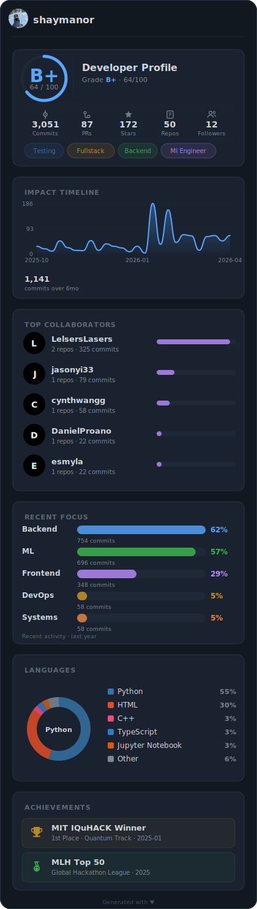

# GitHub README Stats

Generate polished SVG profile cards from your GitHub data. Fetches your repos, contributions, languages, and collaborators, then renders them into composable widgets you can drop into your profile README.

<p align="center">
  
</p>

## Widgets

| Widget | What it shows |
|--------|--------------|
| **Grade** | Letter grade (S through F) with score breakdown, stats, and inferred role tags |
| **Impact** | Contribution timeline over the last 6 months |
| **Collaborators** | Top people you've committed alongside, ranked by shared commits |
| **Focus** | Where your recent work falls (Backend, Frontend, ML, DevOps, etc.) |
| **Languages** | Donut chart of your most-used languages by LOC |
| **Achievements** | Custom badges you define (hackathons, awards, milestones) |

Each widget is also saved individually as `widget_<name>.svg`.

## Quick Start

```bash
# Basic (public data only)
python run.py <username>

# With a GitHub token for full commit/contribution data
GITHUB_PAT=<your-token> python run.py <username>

# Choose a theme
python run.py <username> nord
```

Output lands in the repo root as `widget_<username>.svg`.

## Themes

Five built-in themes:

| Theme | Style |
|-------|-------|
| `midnight` / `dark` | Dark blue-gray (default) |
| `onyx` | High-contrast on near-black |
| `nord` | Muted pastels on slate |
| `clean` / `light` | White background |
| `paper` | Warm off-white, sepia accents |

## Web UI

A React frontend lets you customize widgets interactively with live preview and per-widget advanced settings (colors, counts, etc.).

```bash
# Terminal 1 — start the generator API
python -m src.generator_api          # :5002

# Terminal 2 — start the frontend
cd frontend && npm install && npm run dev   # :3000
```

Open `http://localhost:3000`, enter a GitHub username, tweak settings, and hit Generate.

## Configuration

All tuning lives in `src/config.py` and can be overridden with environment variables. Key knobs:

| Variable | Default | What it does |
|----------|---------|-------------|
| `GITHUB_PAT` | — | GitHub personal access token |
| `COMMIT_MAX_REPOS` | 10 | Max repos to scan for commits |
| `COMMIT_PER_REPO` | 30 | Max commits per repo |
| `COLLABORATOR_MIN_COMMITS` | 3 | Minimum shared commits to show a collaborator |
| `API_TIMEOUT` | 5 | Per-request timeout in seconds |

See [CONFIGURATION.md](CONFIGURATION.md) for the full list.

## Project Structure

```
src/
  data/          # GitHub API fetching + data processing
  widgets/       # One SVG renderer per widget
  themes/        # Color palettes
  models/        # Typed data structures
  utils/         # SVG helpers
  config.py      # All tunables
  generate.py    # CLI entry point
  generator_api.py   # Flask API for the web UI
frontend/        # React + TypeScript + Vite
```
