# github-readme-stats

[](https://github.com/ShayManor/github-readme-stats/actions/workflows/tests.yml)
[](https://github.com/ShayManor/github-readme-stats/actions/workflows/deploy.yml)

A single SVG widget you drop into your GitHub profile README. It scores
your account, charts your contribution timeline, highlights your top
collaborators, breaks down your languages, tracks your commit streaks,
and earns you tags like `Backend`, `ML`, or `Founder #42`.

```md

```


<details>
<summary>Table of contents (click to expand)</summary>

- [Quick start](#quick-start)
- [Themes](#themes)
- [Individual widgets](#individual-widgets)
- [Query parameter reference](#query-parameter-reference)
- [Auto-awarded tags](#auto-awarded-tags)
- [Refreshing your data](#refreshing-your-data)
- [FAQ](#faq)
- [Gallery](#gallery)

</details>

---

## Quick start

1. Open <https://gh-stats.com/api/>.
2. Sign in with GitHub. Signing in is how you prove ownership of the
   username, and it unlocks the editor.
3. Pick a theme, reorder widgets, add any custom tags or achievements.
4. Click **Generate**.
5. Paste this one line into your profile README:

   ```md
   
   ```

The image URL is stable. Once it's in your README you can change
themes, tags, or widget order in the editor at any time without
touching the markdown.

> [!NOTE]
> Only public GitHub activity is counted. Private repos, private
> commit counts, and contributions to org-restricted repos are never
> visible to the fetcher.

---

## Themes

Pass `?theme=<name>` on the URL, or pick one in the editor.

| Theme | Preview |
|---|---|
| `midnight` (default) |  |
| `onyx` |  |
| `nord` |  |
| `clean` |  |
| `paper` |  |

```md

```

### Auto-switching for dark and light mode

Add GitHub's theme suffix to serve a different image to dark vs. light
viewers:

```md


```

Or use `<picture>` for precise `prefers-color-scheme` control:

```html
<picture>
  <source srcset="https://gh-stats.com/api/YOUR_USERNAME?theme=onyx"
          media="(prefers-color-scheme: dark)" />
  <source srcset="https://gh-stats.com/api/YOUR_USERNAME?theme=clean"
          media="(prefers-color-scheme: light)" />
  
</picture>
```

---

## Individual widgets

Every widget is independently addressable at
`https://gh-stats.com/api/<username>/<widget>.svg`. Embed one, two, or all
of them.

### Grade

Overall score (0 to 100), letter grade, and your top role tags.


```md

```

### Impact

Your contribution volume over the last 6 months, drawn as a smooth area
chart.

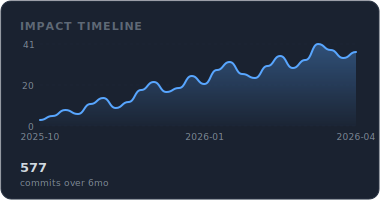

```md

```

### Streaks

Current and longest contribution streaks.

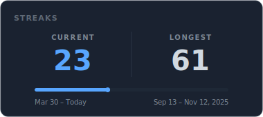

```md

```

### Top collaborators

The people you actually work with, filtered down to repos of a
reasonable size so a drive-by PR to `react` does not put the React team
on your card.


```md

```

### Recent focus

What you have actually been working on lately, grouped by topic.


```md

```

### Languages

Your language mix, weighted by bytes in repos you authored. Forks with
no meaningful contribution are ignored.


```md

```

### Achievements

Hand-entered lines for hackathons, talks, awards, and certifications.

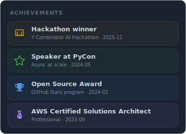

```md

```

### Side by side

GitHub strips inline CSS, so an HTML table is the simplest way to put
two widgets next to each other.

```html
<table><tr>
  <td></td>
  <td></td>
</tr></table>
```

---

## Query parameter reference

Every URL accepts query parameters. They override the owner's saved
settings on a per-embed basis, so viewers can tweak the look without
changing anything the owner has stored.

Values with special characters must be URL-encoded: `#a78bfa` becomes
`%23a78bfa`, a space becomes `%20`.

### Common parameters

| Parameter | What it does | Example |
|---|---|---|
| `theme` | Built-in theme name. | `?theme=onyx` |
| `widgets` | Which widgets to show on the composite card. | `?widgets=grade,streaks,languages` |
| `order` | Render order on the composite card. | `?order=grade,streaks,languages` |
| `hide` | Languages to exclude from the languages widget. | `?hide=HTML,CSS,Makefile` |
| `tags` | Extra custom role tags on the grade widget. | `?tags=ML,Systems` |

### Per-widget parameters

Use dot notation: `<widget>.<key>=<value>`.

| Parameter | What it does | Type | Default |
|---|---|---|---|
| `grade.max_tags` | Max role tags shown (1 to 20). | int | all tags |
| `impact.line_color` | Accent color for the area curve. | hex color | theme accent |
| `streaks.color` | Accent color for the current-streak text. | hex color | theme accent |
| `collaborators.max_count` | Max collaborators shown (1 to 10). | int | 5 |
| `collaborators.bar_color` | Accent color for the commit bars. | hex color | theme accent |
| `focus.max_categories` | Max focus clusters shown (1 to 10). | int | 6 |
| `languages.max_languages` | Max languages shown (1 to 10). | int | 5 |
| `achievements.max_items` | Max achievement rows shown (1 to 10). | int | 5 |

---

## Auto-awarded tags

Some tags on the grade card are earned from real activity. No query
parameter will add them if you have not earned them:

- `Founder #N` is your enrollment number, fixed when you first sign in.
- Role tags like `Backend`, `Frontend`, `ML`, `Mobile`, `DevOps`,
  `Cloud`, `Systems`, `Database`, `Security` are derived from your
  language mix and repo topics.

---

## Refreshing your data

The refresh cron re-pulls GitHub data every 15 minutes, so new commits
usually appear in your widget within that window. GitHub's image CDN
may add another minute or two on top.

If you need an immediate update (for example right after merging
something big), click **Refresh now** in the editor. It is a one-shot
per account, so save it for when it matters.

---

## FAQ

**Can I use a private GitHub account?**
No. The service only reads public activity. Private repos, private
commit counts, and contributions to org-restricted repos are not
visible to GitHub's public API, so they are never part of the widget.

**How fresh is the data?**
Every 15 minutes, automatically. You can also click **Refresh now**
once per account for an immediate update.

**How do I edit my widget?**
Sign in with GitHub at <https://gh-stats.com/api/>. Only the account whose
login matches the username can edit that widget's settings.

**Can I change the widget without re-embedding?**
Yes. The image URL is stable. Edit in the editor, click **Generate**,
and the next fetch serves the new version. GitHub's image cache may
delay propagation by a few minutes.

**Can I embed someone else's widget with my own theme or filters?**
Yes, use the [query parameters](#query-parameter-reference). The
owner's saved settings are not affected.

**I am getting a placeholder card. What is wrong?**
`building` means the first render is still in progress, give it a
minute. `not_found` means GitHub does not know that username.

**Why does my languages card look wrong?**
It counts bytes in repos you authored. Forks with little commit
activity are dropped. Add `?hide=HTML,CSS,Makefile` if generated files
dominate the breakdown.

**Can I reorder widgets?**
Yes, either in the editor (drag and drop) or by passing
`?widgets=...&order=...` on the URL.

---

## Gallery

### Composite themes

<table>
<tr>
  <td align="center"><b>midnight</b><br/></td>
  <td align="center"><b>onyx</b><br/></td>
</tr>
<tr>
  <td align="center"><b>nord</b><br/></td>
  <td align="center"><b>clean</b><br/></td>
</tr>
<tr>
  <td align="center"><b>paper</b><br/></td>
  <td align="center"><b>custom (onyx, 3 widgets)</b><br/></td>
</tr>
</table>

### Single-widget examples

<table>
<tr>
  <td align="center"><b>Grade</b><br/></td>
  <td align="center"><b>Grade (max_tags=3)</b><br/></td>
</tr>
<tr>
  <td align="center"><b>Impact</b><br/></td>
  <td align="center"><b>Impact (purple line)</b><br/>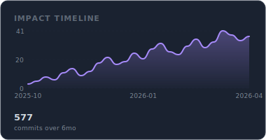</td>
</tr>
<tr>
  <td align="center"><b>Streaks</b><br/></td>
  <td align="center"><b>Streaks (green)</b><br/>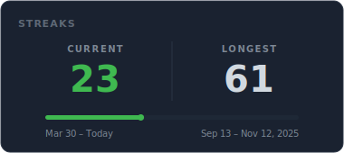</td>
</tr>
<tr>
  <td align="center"><b>Languages</b><br/></td>
  <td align="center"><b>Languages (hide Shell, Dockerfile)</b><br/></td>
</tr>
<tr>
  <td align="center"><b>Collaborators</b><br/></td>
  <td align="center"><b>Focus</b><br/></td>
</tr>
<tr>
  <td align="center"><b>Achievements</b><br/></td>
  <td></td>
</tr>
</table>

### Mix and match

Embed two widgets side by side with an HTML table:

```html
<table><tr>
  <td></td>
  <td></td>
</tr></table>
```
U=findme; docker exec ghstats-generator python -c "import sqlite3; s=sqlite3.connect('/app/data/settings.db'); w=sqlite3.connect('/app/data/widgets.db'); [s.execute(f'DELETE FROM {t} WHERE username=?', ('$U',)) for t in ('users','jobs','user_streaks')]; [w.execute(f'DELETE FROM {t} WHERE username=?', ('$U',)) for t in ('widgets','current_widget','widget_data')]; s.commit(); w.commit(); print('generator: removed', '$U')" && docker exec ghstats-fetcher python -c "import sqlite3; c=sqlite3.connect('/app/data/fetcher.db'); c.execute('DELETE FROM users WHERE username=?', ('$U',)); c.commit(); print('fetcher: removed', '$U')"
Stack a custom composite with only three widgets:

```md

```

Recolor the impact line:

```md

```

Hide noisy languages:

```md

```
